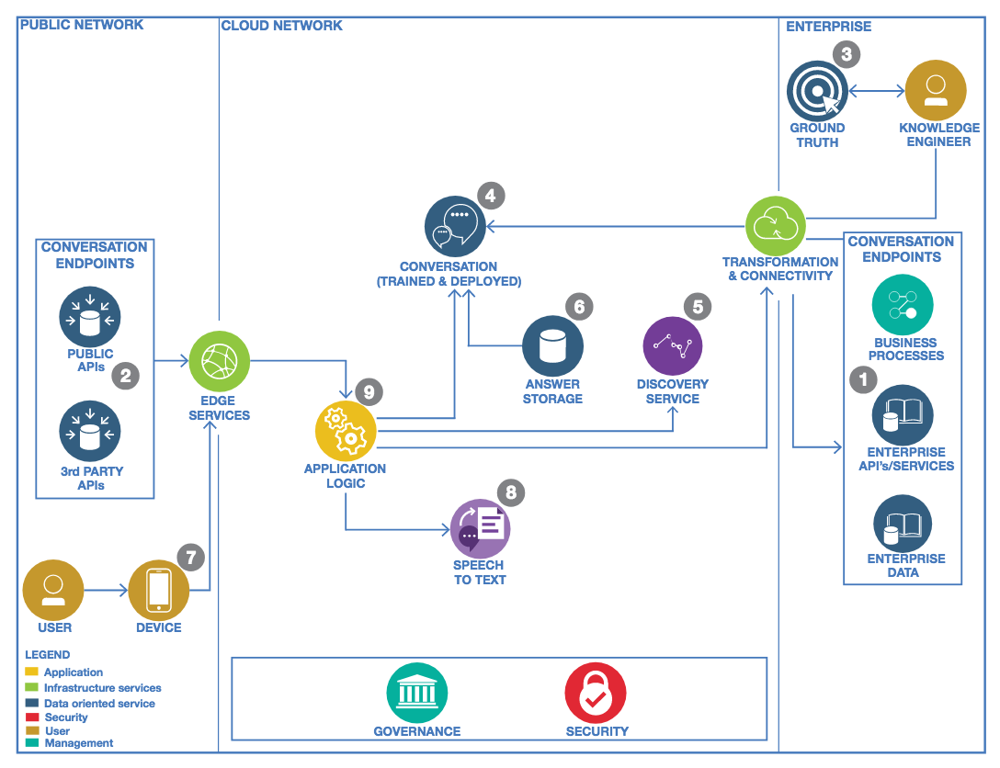
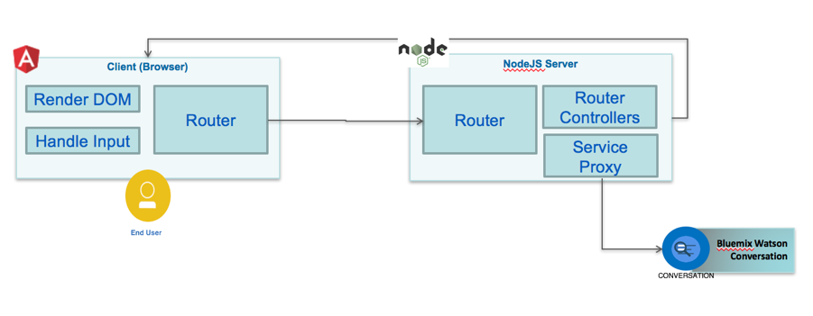

# refarch-cognitive-conversation-broker
This project offers a set of simple APIs in front of Watson Conversation to be consumed by your web interface, your mobile app  or even a business process defined in [IBM BPM on Cloud](http://www-03.ibm.com/software/products/en/business-process-manager-cloud). The project includes an [angular 2](http://angular.io) web application to illustrate a simple conversation front end.
The project is designed as a micro service and deployable as a Cloud Foundry application. The concept of broker is presented in the IBM Cognitive Reference Architecture for Engagement as illustrated in the figure below:

 with the 'Conversation Application' icon.

# Current Version
This version is still under development, it supports the current features:
* User interface done in Angular 2 to start the conversation with a hello message and support a simple input field to enter a question to Watson
* The supported questions depend on the Intents defined in Watson Conversation
* Support the Backend for Front end pattern with a nodejs/ expressjs application.
You may fork this project for your own purpose and develop by reusing the code. If you want to contribute please submit a pull request on this repository.

# Prerequisites

* You need to have a Bluemix account, and know how to use cloud foundry command line interface to push the application
* You need to have nodejs installed on your computer with the npm installer tool too.
* Clone current repository, or if you want to work on the code, fork it and clone your forked repository

```
git clone https://github.com/jbcodeforce/refarch-cognitive-conversation-broker
cd efarch-cognitive-conversation-broker
npm install
```

# Link to your Conversation service
You need to create a Watson Conversation Service in bluemix, get the credential and update the file env-templ.json under server/routes folder with your own credential
```
{
    "conversation" :{
      "version":"2017-02-03",
      "username":"",
      "password":"",
      "workspaceId":"",
      "conversationId":""
    }
}
```
Rename the file as env.json

# REST APIs exposed
/api/conversation

# Code explanation  
The project is split into two parts: the client side that is an Angular 2 single page application and the server which is an expressjs app.


## Server side
The code is under the server folder. The server.js is the main javascript started when the *npm start* command is executed.
The server uses expressjs, serves a index.html page for the angular2 front end, and delegates to another javascript the call to url /api/*

```
const express = require('express');
const app = express();

const api = require('./routes/api');
// Set our api routes
app.use('/api', api);

/ Catch all other routes and return the index file
app.get('*', (req, res) => {
  res.sendFile(path.join(__dirname, '../dist/index.html'));
});
...
```
This code needs to be improve with authentication and autorization controls.

The api.js defines the URL to be used by angular 2 ajax calls. Most of the user interactions on the Browser are supported by Angular 2, with its Router mechanism and the DOM rendering capabilities via directives and components. When there is a need to send data to the server for persistence or calling one of the Cognitive Service, an AJAX calls is done and the server will respond asynchronously later.

api.js uses the express middleware router to handle URL mapping.

```
const express = require('express');
const router = express.Router();
const router = express.Router();

router.post('/conversation',function(req,res){
  ...
```
On the HTTP POST to /api/conversation the text is in the request body, and can be sent to Watson conversation.

So the last piece is the Watson Conversation Broker under routes/features/conversation.js

This code is straight forward, it loads configuration from the env.json file or the VCAP service if the application is deployed to Bluemix, then it uses the Watson cloud developer javacsript apis.

```
exports.submit = function(message,next) {
      console.log(message);
      var wcconfig = extend(config.conversation, vcapServices.getCredentials('conversation'));
      var conversation = watson.conversation({
        username: wcconfig.username,
        password: wcconfig.password,
        version: 'v1',
        version_date: wcconfig.version
      });
      if (message.context === undefined) {
          message.context={"conversation_id":wcconfig.conversationId};
      }
      conversation.message({
          workspace_id: wcconfig.workspaceId,
          input: {'text': message.text},
          context: message.context
        },  function(err, response) {
            if (err)
              console.log('error:', err);
            else
              next(response);
        });
}
```
As the conversation holds a context object to keep information between different interactions, the code specifies a set of needed attributes. See Watson Conversation API for information about the context.

## Angular 2 client app
The code is under client folder.

# Deploy to Bluemix
