# Watson Conversation Hands-on Tutorial

In this tutorial you will implement a simple 'IT Support help-me' conversation in the context of Case Inc, which  is a medium size retail company, where employees access a set of intranet business applications. The support director wants to modernize the way to support internal staff and offload his team from basic work. Currently 20000 tickets are issued in a year. 50% of the calls are answered in 7 minutes whereas there are many situations that reach up to 70 minutes for resolution. 92% of the calls are resolved by level 1 support. Employees of the Case Inc engage with customer support mostly through phones. Today, call center agents struggle to find some of the answers in a timely fashion as the systems are not integrated. This results in loss of productivity and frustration on the part of the bank employees. Level 1 support team get frustrated at times because of unavailability of the right information and proper guidance. The Level 1 support has to consult the Level 2 support team members to get some answers.   

As presented in the [Watson Conversation reference architecture diagram](https://www.ibm.com/devops/method/content/architecture/cognitiveArchitecture) this tutorial addresses the Ground Truth development (3), the conversation flow design and the run time processing (4) from a business application simple interface (9).

## Watson Conversation Quick Summary
To have a quick understanding of Watson conversation read the [overview](https://www.ibm.com/watson/developercloud/doc/conversation/index.html) section.
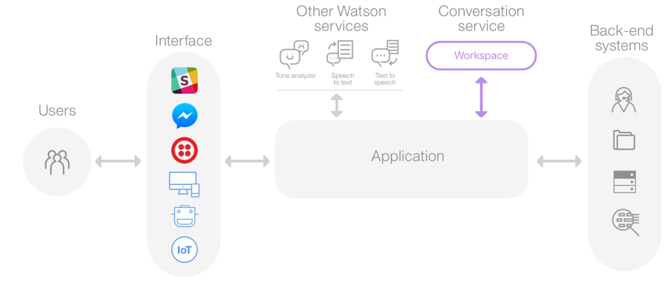

As a summary, you use the Watson Conversation service to create a **bot**. This is the generic term for a piece of software that provides automated responses to user input. The bot is hosted in the cloud and highly available. All the information that defines your bot's behavior is contained in a **workspace**.
You create an **application** that enables your users to interact with the bot. The application passes user input to the bot, possibly with some additional context information, and presents responses from the bot to the user.
The bot is **stateless**, that is, it does not retain information from one interchange to the next. The application is responsible for maintaining any continuing information. However, the application can pass information to the bot, and the bot can update the **context** information and pass it back to the application.
The bot uses natural language understanding and machine learning to extract meaning from the user's input. This process identifies the user's **intent**, which is the goal or purpose of the input. It can also identify an **entity**, which is a term that is mentioned in the input and clarifies the purpose. You train your bot to recognize intents and entities in the input submitted by users. To train your bot on intents, you supply lots of examples of user input and indicate which intents they map to. To train your bot on entities, you list the values for each entity and synonyms that users might enter.
Note: the names of intents and entities, and the text of examples, values, and synonyms, can be exposed in URLs when an application interacts with your bot. Do not store sensitive or personal information in these artifacts.
As you add information, the bot trains itself; you do not have to take any action to initiate the training.
Finally, after you train your system to recognize intents and entities, you teach it how to respond when it recognizes those intents and entities. You use the **dialog** builder to create conversations with users, providing responses based on the intents and entities that you recognize in their inputs.

## Development Steps
The following tasks have to be done for a project involving Watson Conversation:
* Gather requirements for the conversation and how the customer is supporting the use case today. (they may have script, coded procedure, ….)
* Define Persona and Empathy map
* Build System Context Diagram
*	Extract the potential list of intents and assess sentences that lead to those intents
*	Create a Watson Conversation service in bluemix
*	Define the intent with the conversation builder tool
*	Define entities
*	Start the dialog flow, unit test it
*	Develop the webapp or microservice responsible to interact with Watson Conversation and implement some of the business logic to handle the conversation context
*	Add any other component to complement the business requirements, it could be Retrieve and Rank, ODM business rules, BPM process…


## Design Thinking
When implementing a cognitive solution, we may want to apply the Design Thinking methodology as it helps transforming a business improvement idea to concrete business application end users will use. The principles of empathy with users, prototyping or Minimum Viable Product and tolerance for failure are applied as part of the method.
The storyboarding is one of such Design Thinking practice, where personas’ challenges and pains are addressed via stories. When engaging with a project team the first main exercise is to gather the requirement around Cognitive system and the use of the potential new application. Empathy maps are developed.  First we need to gather is the list of Personas as presented in screen shot below:  

then we need to develop with the project team and end users the empathy map to address pains and challenge but more data points so we can be more in empathy with the user of the application. The following diagram is a map for the internal user persona developed using [Mural](https://app.mural.ly).  
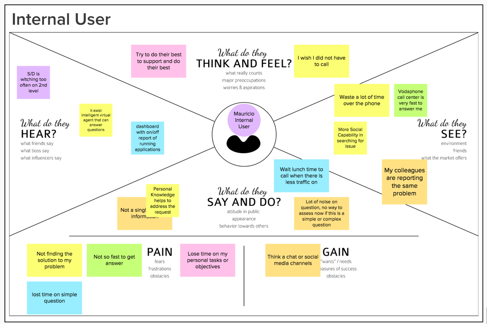

Another artifact to build, as soon as possible, and then enhance over time, is a System Context Diagram which helps assessing what are the systems to interact with.


The system context serves also to organize the work into teams, micro services development and crowd sourcing work for the Natural Language training tasks.

The end user interacts with a WebApp developed with nodejs deployed as Cloud Foundry App on Bluemix. The main component is the Watson Conversation service, but the application could be connected to Watson Discovery to complement the dialog with searching into a knowledge corpus and to an event driven service which can aggregate the business application states: When an end user is complaining about not able to access a given business application, the Conversation could generate an action, which will lead to get real time state of the application. This state management is supported by Operational Decision Management Advanced which is a complex event processing platform. See proposed enhancement in

The dialog is stateless, meaning that it does not retain information from one interchange to the next. Your application is responsible for maintaining any continuing information. However, the application can pass information to the dialog, and the dialog can update the context information and pass it back to the application. So each conversation solution needs to include this service orchestration to control data gathering and dialog context.

# Hands on lab - Step by step
So now let start doing your own conversation!. Using your bluemix account, add a Watson Conversation Service. Select Catalog > Services > Watson.

Once created you can launch the conversation tool to develop the conversation artifacts.
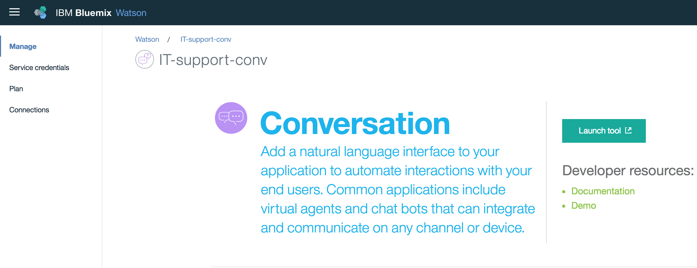

## Creating a workspace
The workspaces enable you to maintain separate intents, user examples, entities, and dialogs for each use or application. The conversation service uses a step by step, wizard like, approach to guide the developer to create workspace, intents, etc..  


Once the workspace created, we need to add intents using the interface. An Intent is a group of examples of things that a user might say to communicate a specific goal or idea. To identify intents, you begin with something your user might want, and then come up with various ways the user might describe it. Then for each intent, you need to think of the various ways a user might express her desire, that will be the examples. Examples can be developed with crowd sourcing approach.

From the discussion with Support team the team arrives with a set of standard questions they received from their end users:
* What is the status of the business application? I could not access it
* How to get access to a business application?
* How to reset my password for a specific application?
* When to renew my workstation?
* How to bring my own device and connect it to enterprise network?

And specific regulation or business process oriented
* What is the procedure to manage a reimbursement claim or a specific business process?

Each of those questions are documented as FAQ inside the Support team. Even some solutions are persisted in a relational database in the form of application -> problem -> solution relationship.

## Creating intent

In the context of this tutorial we can extract the following intents
* Access to a business application or a business process.  
* Reset password
* Procedure or process to execute
* Bring own device

So let add those intents in the workspace: the following diagram illustrates how to add application Access intent with some of the training set questions:

For each intent we need to add the examples to train the conversation for intent recognition:

As there are a lot of intents that can be reused from conversation to other conversation it is possible to define csv files to import intents. The format is presented in following example, one intent in each line  
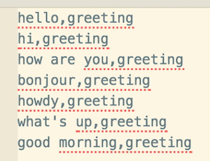

import the tutorial/wcs-workspace/ITSupport-Intents.csv file to get the IT support demonstration intents.

## Unit testing
As soon as you have created intent you can test it, using the ‘Ask Watson’ button on the top right corner of the conversation editor.
Enter one of the example, you should get the #greeting intent identified by Watson. You can even try new sentence and you may have Watson inferring the good intent.  


## Adding entities
An entity is a portion of the user's input that you can use to provide a different response to a particular intent. Adding values and synonyms to entities helps your bot learn and understand important details that your users mention.
Each entity definition includes a set of specific entity values that can be used to trigger different responses. Each value can have multiple synonyms, which define different ways that the same value might be specified in user input.

Create entities to represent what the application the user wants to access.  

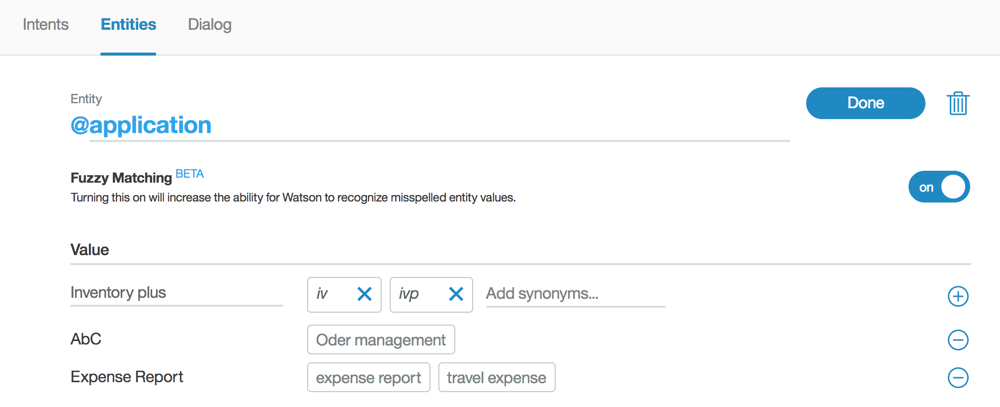

## Building the dialog
When your intents and entities are specified, you can move on to constructing the dialog flow.
  
A dialog is made up of nodes, which define steps in the conversation. Dialog nodes are chained together in a tree structure to create an interactive conversation with the end user.
### Defining Greetings node
The first node you will add is to support how to handle the #greetings intent, so let be polite and ask how the bot can help.
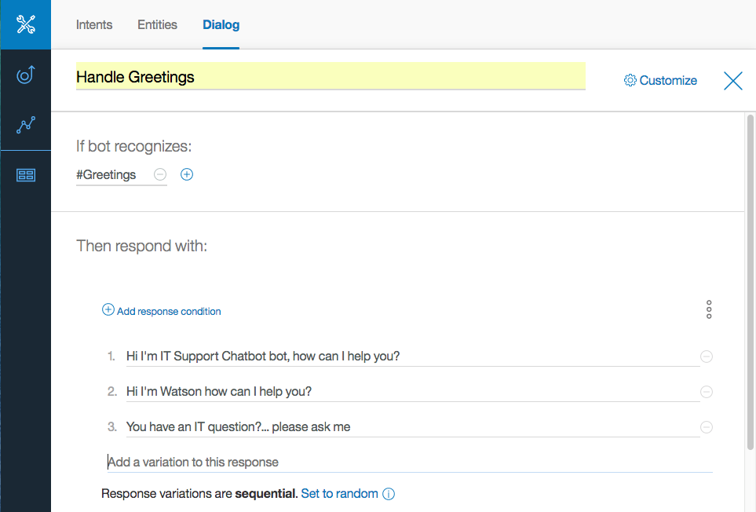  
The above diagram also illustrates the multiple responses pattern to avoid to be repetitive, the bot can present different answers to the same query. It is possible to let the system picks up randomly an answer from the list of potential responses.

Use the try it out feature (right top corner icon) to unit test your dialog:  


At the beginning of each conversation, evaluation begins at the top level of dialog nodes.

Your initial node has two plus signs, one to the right and one at the bottom. These represent two different ways to expand on the conversation. Clicking the plus sign at the bottom will create a parallel track of conversation, clicking the one on the right will create a dependent track of conversation, meaning the conversation is becoming a tree.

You need to create a dialog branch for each intent, to gather any required information and make helpful responses.
### Managing otherwise use case
Your second node is to manage otherwise, and it could prompt a default message as illustrated below.
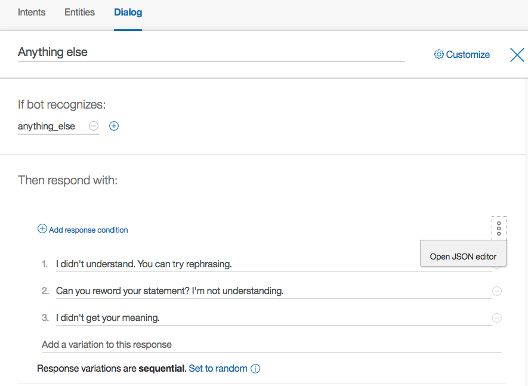
The response is defined using the JSON view of the response (access it using the 3-dots icone on the right side of the response editor). It includes an output json object with a text. The other interesting part is the added variable "Missing case" set to true. When persisting the conversation flow, it will be possible to link the query that was not addressed by the dialog nodes, so later on the Conversation developer can add more cases if it makes sense.

### Defining the access application dialog flow
Now we can create dialog branches that handle the ‘access application’ intent. Select a node and click on the + between node to add a branch
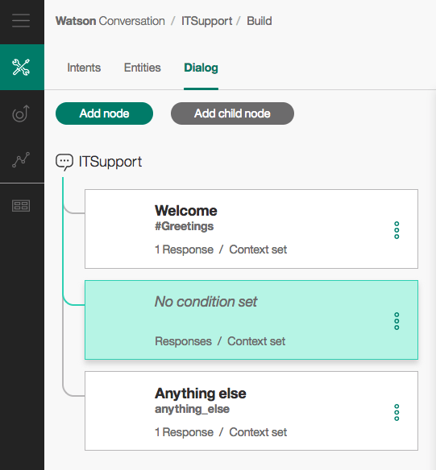

When a user enters a query about application access he will, most likely, specify one of the supported application, so on the right side of the Application Access node we will add sub branches for each known application and the node could ask more question or provide directly a solution.
Starting by AbC, use the + sign on the right side of the ‘Application Access’ node so we can create condition on the entity. In the condition select the **@application:AbC** and then provide the solution to access the app.
  
If you test the dialog you will see the intent and entity are understood but the solution is not given. There is not path from ‘Application Access’ node to the ‘AbC access’ node. To make the connection there is a Link icon within ‘Application Access’ node to define the link between Application Access node and AbC node.
  
Now a test with the sentence: I want to access application AbC will gives intent: ApplicationAccess, entity application AbC and then the node match and gives the expected response:
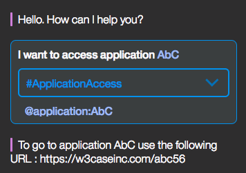  
Finally, if the user does not specify any application we want to ask him which one to access from a list of predefined app. This is another response pattern where predefined content can be selected by user. So add a node like below:
  
Now if you enter a sentence like: “Access application”, then it will propose the expected response.

Then entering one of the choice like “Inventory Plus” will give not the expected result, as the classifier extract the intent ‘Greetings”. But you can enforce Watson Conversation to do a better job in the future by selecting the good answer for him: select applicationAccess intent and then Watson will retrain. Once done a second test will make the conversation works as expected.

Make sure you try out some statements that aren’t exactly the same as your training data.

Adding any new entity or intent, will make Watson Conversation retraining its classifier as we could see in the Try it out window.
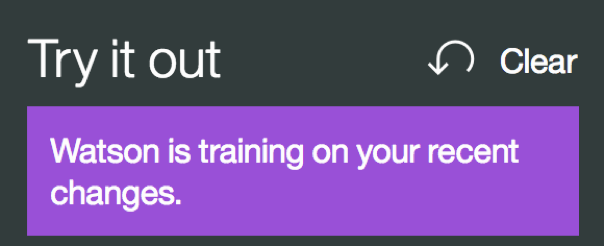

Before going farther in the detail of using conversation context variable, we will try to access the conversation via API for that see the separate [instructions](use-apis.md).

### Using Context
Each time the dialog returns a response and waits for user input, it stores the ID of the node at which the conversation should resume. This node is called the contextual node, and its ID is added to the context.system.dialog_stack property, which contains a JSON array of dialog node IDs that are currently on the dialog stack.
State information for your conversation is maintained using the context. The context is a JSON object that is passed back and forth between your application and the Conversation service

Here is an example of context returned from an interaction reaching a top node:
```
"context": {
     "conversation_id": "Conversation-ut",
     "system": {
       "dialog_stack": [
         {
           "dialog_node": "root"
         }
       ],
       "dialog_turn_counter": 1,
       "dialog_request_counter": 1,
       "_node_output_map": {
         "AbC access": [0]
       },
       "dialog_in_progress": false
   }
```

The evaluation round works in two stages. In the first stage, the dialog tries to find an answer in the child nodes of the contextual node. That is, it tries to match all the conditions of the child nodes of this contextual node. If the final child node has a condition of "true", meaning that it is to be used if none of its siblings have been matched, then that node's response is processed. Otherwise, if no match is found, the dialog continues to a second stage in which it tries to find an answer to a particular input by matching the top level of dialog nodes.

The top level of dialog nodes should contain an anything_else node as the last node, which is hit when no match occurred in the conditions of the top level nodes. Typically, if an anything_else node is defined, the dialog returns an answer to every user input.

### Adding variable to context
Suppose that we want to return an actionable URL, meaning the response includes a url variable and the content is presented to the user so he can click on it to navigate to a new service end point. To illustrate this we will present a URL of a business process deployed on BPM on Cloud. Therefore we are adding a new intent for Supplier on boarding named #supplieronboarding:
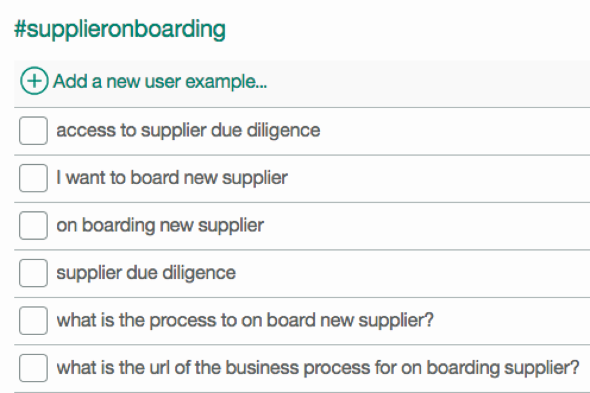  
a new node is added to the dialog, but instead of defining a static text response, we use the {...} icon to access the Advanced editor so we can edit a json response object:


The object includes an output with the text to present and a context with a new variable named url to get the BPM on cloud access and an action variable to control the behavior of the broker code. When the user enters a question like: “I want to access the supplier on boarding business process” the returned object looks like:
```
{
    "intents": [
      {
        "intent": "supplieronboarding",
        "confidence": 0.940047025680542
      }
    ],
    "entities": [
      {
        "entity": "supplier",
        "location": [
          0,
          8
        ],
        "value": "supplier"
      }
    ],
    "input": {
      "text": " I want to access the supplier on boarding business process"
    },
    "output": {
      "log_messages": [],
      "text": [
        "To access the Supplier On Boarding business process use the url: "
      ],
      "nodes_visited": [
        "Supplier On Boarding",
        "Provide URL for Supplier on boarding"
      ]
    },
    "context": {
      "conversation_id": "Conversation-ut",
      "system": {
        "dialog_stack": [
          {
            "dialog_node": "root"
          }
        ],
        "dialog_turn_counter": 1,
        "dialog_request_counter": 1,
        "dialog_in_progress": false
      },
      "url": "https://vhost001.bpm.ibmcloud.com/bpm/dev/ProcessPortal/dashboards/SYSRP/RESPONSIVE_WORK",
      "action":"click"
  }
```
The code that call the Watson Conversation API can take the url value and creates an hyperlink in html so the display have actionable link:
``` javascript
if (rep.context.url != undefined) {
  if (rep.context.action === "click") {
      rep.text=rep.output.text[0] + "<a class=\"btn btn-primary\" href=\""+rep.context.url+"\">Here</a>"
  }
}
```
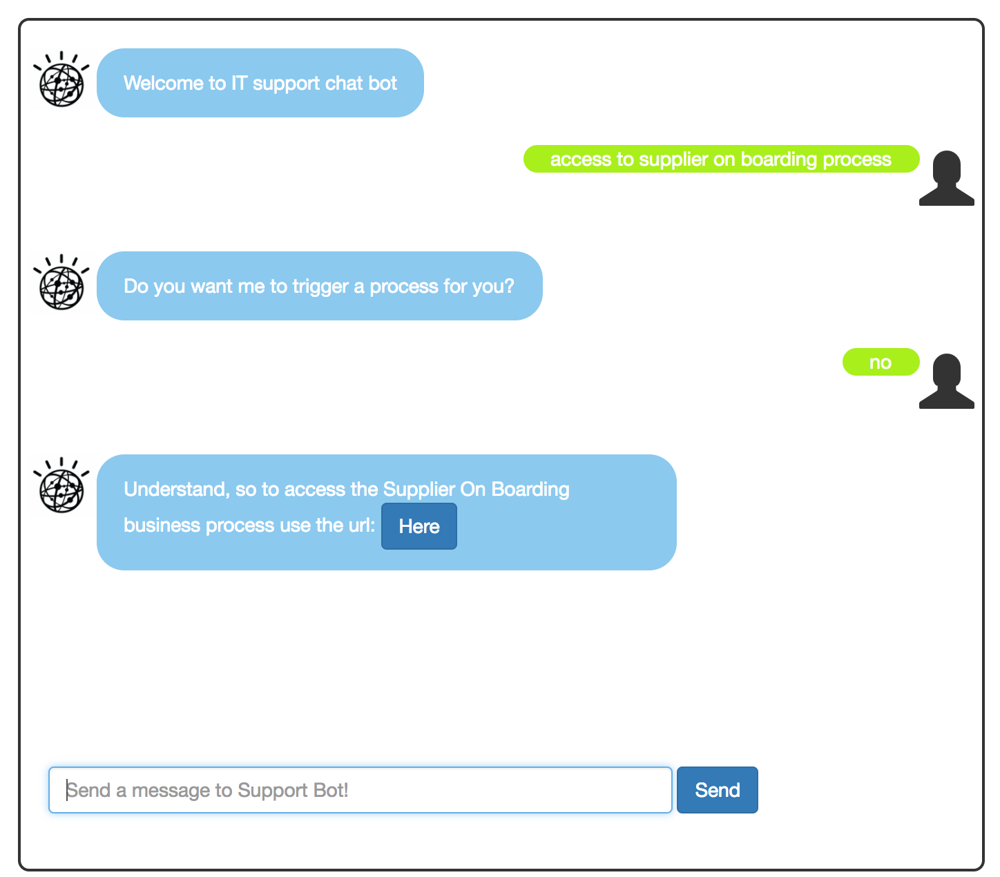  

A lot can be done on the context object. For example, the application code could add elements in the context before calling conversation, then at the condition level in a node, test can be done on those elements. To use a context variable in your condition, use the format $variable_name:value or $variable_name == 'value'. The value of the condition might have been set by the application, or in the response portion of a previous dialog node. In the test below the context variable canAccessSOD is a Boolean set by accessing some internal authorization service that, for example, return true if a given userid can access an application.  
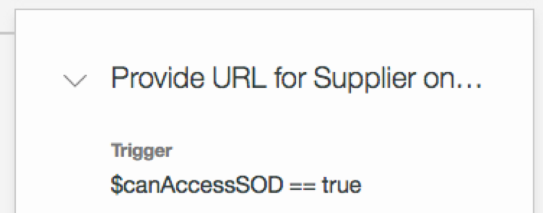  


## References
* A super simple chat bot designed for customer service [here](https://www.ibm.com/blogs/watson/2016/12/build-chat-bot)
* Watson Conversation simple [Product tutorial](https://www.ibm.com/watson/developercloud/doc/conversation/tutorial.html)
